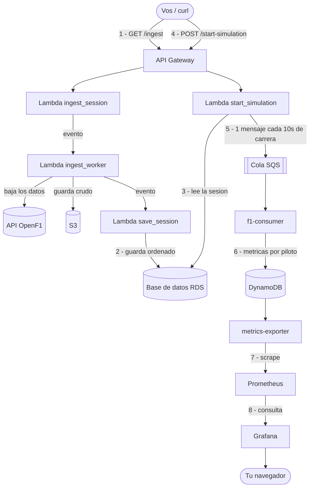
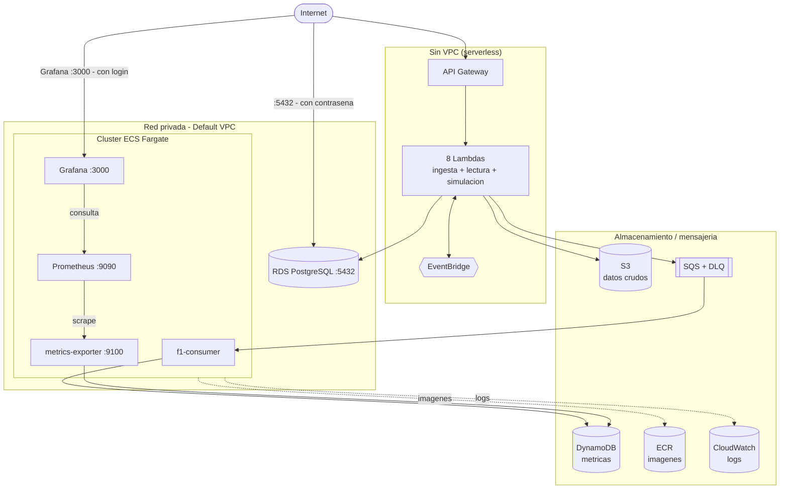

# RaceTrack — Arquitectura (resumen)

**¿Qué hace el proyecto?** Toma datos reales de una sesión de Fórmula 1 (API pública
[OpenF1](https://openf1.org)), los guarda, los "reproduce" como una simulación acelerada, calcula
métricas por piloto y las muestra en vivo en un tablero de **Grafana**.

- **Cuenta AWS:** `190914649240` · **Región:** `us-east-1`
- **Dos entornos iguales:** `staging` (pruebas) y `prod` (producción). Misma cuenta, separados por
  el prefijo de nombres `racetrack-<entorno>-*`.
- **Infra como código:** Terraform · **Despliegue:** GitHub Actions (push a `staging` despliega
  staging; push a `main` despliega prod y crea la etiqueta `version_X.Y.Z`).

---

## 1. Cómo funciona, paso a paso

Hay **dos fases**: primero _cargar_ una sesión, después _simularla_ y _verla_.



**En palabras simples:**

1. **Cargar la sesión** → `GET /ingest?session_key=9158`. Responde al toque (`202`) y sigue
   trabajando solo por detrás.
2. Por detrás: `ingest_worker` baja los datos de OpenF1 y los deja en **S3**; después
   `save_session` los ordena y los guarda en la base de datos **RDS**. (Tarda ~30–60s la primera vez.)
3. **Simular** → `POST /start-simulation` con `{session_id, simulation_duration_seconds}`.
4. `start_simulation` lee la sesión de RDS, la corta en **bloques de 10 segundos de carrera** y
   manda **un mensaje por bloque** a la cola **SQS**.
5. **f1-consumer** va leyendo la cola y calcula las métricas de cada piloto, guardándolas en
   **DynamoDB**.
6. **metrics-exporter** lleva el "reloj" de la simulación y publica las métricas del momento actual.
7. **Prometheus** las recoge y **Grafana** las dibuja en el tablero _RaceTrack — F1 Telemetry_.

> 💡 La simulación comprime toda la carrera en los minutos que le pidas
> (`simulation_duration_seconds`, ej. 300 = 5 minutos).

---

## 2. Qué servicios de AWS usamos (y dónde viven)

Pensalo en **3 grupos**: lo que mira a internet, lo que está dentro de la red privada (VPC) y los
servicios de almacenamiento.



### Lo importante de la red y la seguridad

- Las **Lambdas** y la **API Gateway** no están en la VPC (son "serverless", no manejás servidores).
- Los 4 contenedores corren en **ECS Fargate** dentro de la VPC, en subredes públicas (sin NAT), por
  eso cada tarea tiene IP pública para poder salir a buscar imágenes y hablar con los otros servicios.
- **Lo único expuesto a internet del monitoreo es Grafana (puerto 3000) y pide usuario y contraseña.**
  Prometheus y el exporter quedaron cerrados hacia afuera (solo se ven entre ellos por dentro).

| Servicio            | Puerto | Quién puede entrar                                                         |
| ------------------- | ------ | -------------------------------------------------------------------------- |
| Grafana             | 3000   | Internet,**pero con login** (anónimo apagado, contraseña en secreto de CI) |
| Prometheus          | 9090   | Solo interno (no internet)                                                 |
| metrics-exporter    | 9100   | Solo dentro de la VPC (no internet)                                        |
| f1-consumer         | —      | Nada entra (solo sale)                                                     |
| RDS (base de datos) | 5432   | Internet con contraseña (las Lambdas están fuera de la VPC)                |

> 💰 **No puede explotar el costo:** la cuenta usa el plan de créditos gratis. Si algo se abusa, se
> gastan los créditos y AWS _pausa_ el acceso — nunca te llega una factura sorpresa a la tarjeta.

---

## 3. Tabla rápida de componentes

| Para qué           | Componente                     | Detalle                                                             |
| ------------------ | ------------------------------ | ------------------------------------------------------------------- |
| Puerta de entrada  | API Gateway (HTTP)             | Rutas `/ingest`, `/sessions`, `/drivers`, `/start-simulation`, etc. |
| Lógica por eventos | 8 Lambdas (Python)             | Ingesta, lecturas y arranque de simulación                          |
| Eventos internos   | EventBridge                    | Encadena `ingest_worker` y `save_session`                           |
| Procesos largos    | f1-consumer (Fargate)          | Cola SQS → métricas en DynamoDB                                     |
| Procesos largos    | metrics-exporter (Fargate)     | DynamoDB → métricas Prometheus, lleva el reloj                      |
| Monitoreo          | Prometheus + Grafana (Fargate) | Recolecta y dibuja los tableros                                     |
| Datos crudos       | S3                             | Lo que baja de OpenF1                                               |
| Base de datos      | RDS PostgreSQL                 | Eventos de la sesión (`session_events`)                             |
| Métricas           | DynamoDB                       | Una tabla, expira sola (TTL)                                        |
| Mensajería         | SQS + DLQ                      | Un mensaje por bloque; reintenta 3 veces                            |
| Imágenes           | ECR                            | 4 repos de contenedores                                             |
| Logs               | CloudWatch                     | Logs de Lambdas y contenedores                                      |

---

## 4. Interruptores (para prender/apagar y cuidar el costo)

| Variable            | Por defecto | Qué hace                                               |
| ------------------- | ----------- | ------------------------------------------------------ |
| `enable_ecs`        | `false`     | Crea el cluster +`f1-consumer` y `metrics-exporter`    |
| `enable_monitoring` | `false`     | Crea Prometheus + Grafana (necesita `enable_ecs=true`) |

Se configuran por entorno en `terraform/environments/<entorno>.tfvars`. Las imágenes se suben a ECR
en cada despliegue igual, así que prender un interruptor nunca falla por falta de imagen.

---

## 5. Cómo probarlo

```bash
API="https://<id-api>.execute-api.us-east-1.amazonaws.com"   # uno por entorno
curl "$API/ingest?session_key=9158"                          # async, ~30-60s la 1ra vez
curl -X POST "$API/start-simulation" -H 'content-type: application/json' \
     -d '{"session_id":"9158","simulation_duration_seconds":300}'
# después abrí Grafana, tablero "RaceTrack — F1 Telemetry", y elegí la simulación más nueva
```

Para ver las IPs actuales de Grafana/Prometheus (cambian al reiniciar la tarea):

```bash
cd project && ./scripts/monitoring_ips.sh            # staging
cd project && ENV=prod ./scripts/monitoring_ips.sh   # prod
```
